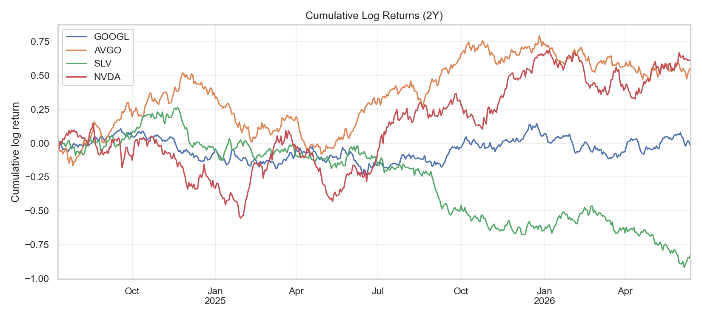
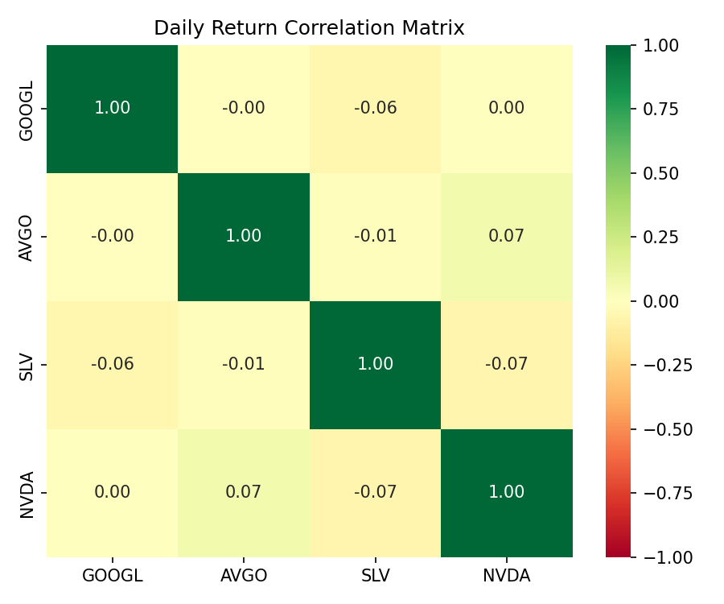
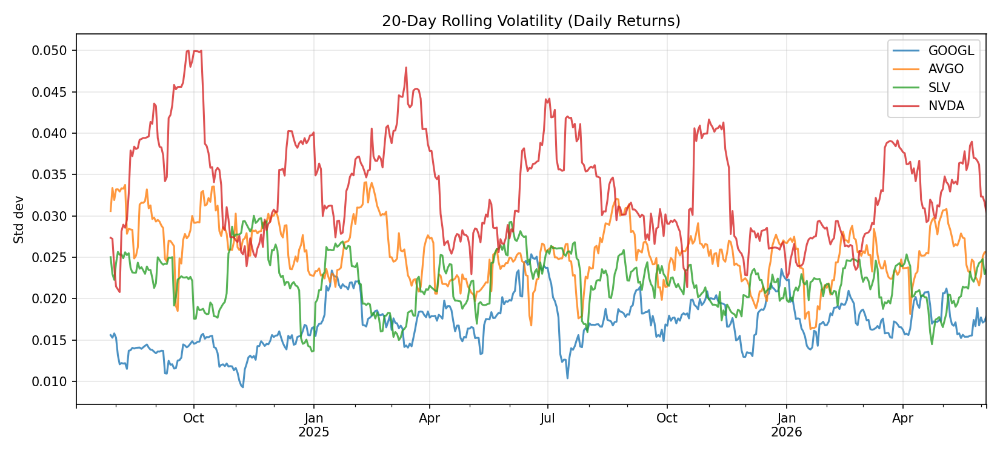
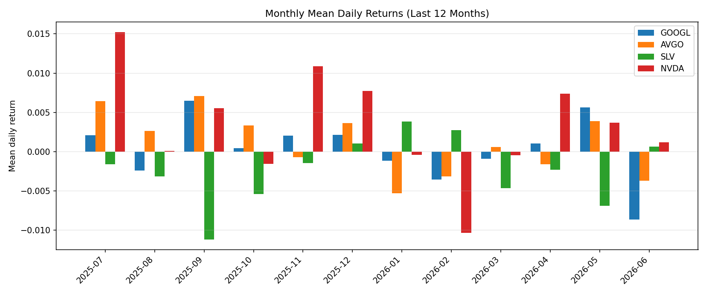

# Financial Analysis Demo

[](LICENSE)
[](https://github.com/bobooooo6868/financial-analysis-demo/actions/workflows/ci.yml)

基于 **Python / Pandas / NumPy** 对四只标的近两年日线收盘价进行采集、清洗与量化分析。

**仓库地址：** [github.com/bobooooo6868/financial-analysis-demo](https://github.com/bobooooo6868/financial-analysis-demo)

| 代码 | 说明 |
|------|------|
| GOOGL | 谷歌 |
| AVGO | 博通 |
| SLV | iShares 白银 ETF |
| NVDA | 英伟达 |

## 分析结论

基于近两年日收益数据的统计与可视化，主要发现如下：

1. **波动率分化明显** — 科技股中 NVDA、AVGO 的日收益标准差通常高于 GOOGL；SLV 作为商品 ETF，波动特征与科技股不同，需结合 `std` 列对照各标的的风险水平。
2. **科技股联动性强** — GOOGL、AVGO、NVDA 三只科技股日收益相关系数普遍为正且较高，反映同一板块内的共同市场驱动因素。
3. **SLV 与科技股低相关** — SLV 与三只科技股的平均相关系数明显更低，体现股票与大宗商品在驱动逻辑上的差异，具有一定分散化价值。
4. **滚动波动率揭示风险阶段** — 20 日滚动波动率在宏观事件、财报季或行业主题（如 AI）活跃期会出现尖峰；SLV 的尖峰则更多与贵金属价格及宏观预期相关。
5. **长期收益轨迹差异** — 累计对数收益曲线直观展示各标的在样本期内的相对表现，NVDA 在 AI 周期中往往累计收益领先，但伴随更高波动。

> 完整交互式报告见 [`notebooks/main.ipynb`](notebooks/main.ipynb)。图表由 `python main.py` 生成并保存至 `images/`。

## 可视化结果

### 累计对数收益

展示各标的从样本起始日至当前的累计对数收益轨迹，便于比较长期收益趋势。



### 日收益相关矩阵

颜色越绿表示正相关越强，越红表示负相关越强。用于判断科技股之间的联动程度及 SLV 与科技股的差异。



### 20 日滚动波动率

反映短期风险水平随时间的变化，尖峰通常对应市场剧烈波动或重大事件阶段。



### 最近 12 个月月均日收益

按月比较各标的平均日收益，便于观察阶段性相对强弱。



## 项目结构

```
financial-analysis-demo/
├── data/
│   ├── raw/              # 各标的原始 CSV（运行后生成）
│   └── processed/        # 清洗后的宽表；含 prices_wide_demo.csv（离线演示）
├── tests/                # pytest 单元测试
├── LICENSE
├── notebooks/
│   ├── main.ipynb        # 主分析报告（作业提交用）
│   └── 01_stock_overview.ipynb
├── src/
│   ├── data_fetch.py     # 数据采集与清洗
│   ├── analysis.py       # 收益、滚动、相关性、重采样
│   ├── utils.py          # NumPy 统计工具函数
│   ├── plotting.py       # 图表生成
│   ├── demo_data.py      # 合成演示数据（限流备用）
│   └── config.py         # 常量配置
├── images/               # 导出的图表 PNG
├── main.py               # 一键运行全流程
├── requirements.txt
└── README.md
```

## 快速开始

### 1. 克隆仓库

```bash
git clone https://github.com/bobooooo6868/financial-analysis-demo.git
cd financial-analysis-demo
```

### 2. 创建虚拟环境并安装依赖

**Windows (PowerShell)**

```powershell
py -3.13 -m venv .venv
.\.venv\Scripts\Activate.ps1
pip install -r requirements.txt
python -m ipykernel install --user --name financial-analysis --display-name "Python (financial-analysis)"
```

**macOS / Linux**

```bash
python3 -m venv .venv
source .venv/bin/activate
pip install -r requirements.txt
python -m ipykernel install --user --name financial-analysis --display-name "Python (financial-analysis)"
```

国内用户可在 pip 命令后追加镜像参数，例如：

```bash
pip install -r requirements.txt -i https://pypi.tuna.tsinghua.edu.cn/simple --trusted-host pypi.tuna.tsinghua.edu.cn
```

### 3. 运行分析

**命令行一键运行（下载数据 + 分析 + 出图）**

```bash
python main.py
```

若 **yfinance 限流**（`Too Many Requests`），可先用演示数据跑通流程：

```bash
python main.py --demo
```

`--demo` 会加载仓库内置的 [`data/processed/prices_wide_demo.csv`](data/processed/prices_wide_demo.csv)（固定种子合成数据），无需联网即可复现分析流程。稍后再去掉 `--demo` 重新下载真实行情。

**Jupyter Notebook（含 Markdown 结论）**

```bash
jupyter lab notebooks/main.ipynb
# 或在 VS Code 中打开 notebooks/main.ipynb
```

选择内核 **Python (financial-analysis)**，从上到下运行所有单元格。

**仅重新下载数据**

```bash
python -m src.data_fetch
```

### 4. 运行测试

```bash
pytest tests/
```

详细输出可加 `-v`：`pytest tests/ -v`

## GitHub Actions 自动检查

[`.github/workflows/ci.yml`](.github/workflows/ci.yml) 在每次 **push / PR** 到 `master` 或 `main` 时自动运行，无需联网：

1. 安装依赖（`pip install -r requirements.txt`）
2. 运行 `python main.py --demo`（内置演示数据 + 出图）
3. 运行 `pytest tests/`

[](https://github.com/bobooooo6868/financial-analysis-demo/actions/workflows/ci.yml)

即使作为课程作业项目，也能体现代码可自动验证、可复现。

## 作业对应关系

| 步骤 | 内容 | 主要代码 |
|------|------|----------|
| 1 | 采集、清洗、`merge` 宽表 | `src/data_fetch.py` |
| 2 | 收益率、NumPy 向量化统计、正态性/平稳性检验 | `src/analysis.py`, `src/utils.py` |
| 3 | 滚动均线/波动率、`corr`、`groupby`、`resample` | `src/analysis.py` |
| 4 | Notebook 报告 + 图表 + GitHub | `notebooks/main.ipynb`, `images/` |

## 技术栈

`yfinance` · `pandas` · `numpy` · `matplotlib` · `seaborn` · `scipy` · `statsmodels` · `jupyter`

完整依赖见 [`requirements.txt`](requirements.txt)。

## 数据来源与说明

- 行情数据通过 [yfinance](https://github.com/ranaroussi/yfinance) 获取，存在延迟，仅供学习与研究使用。
- 原始 CSV 默认不纳入版本控制，运行后本地生成；图表 PNG 提交至仓库便于 GitHub 展示。
- 使用 `--demo` 时加载内置演示宽表，统计结果与真实市场不同，仅用于验证流程。

## 许可证

本项目采用 [MIT License](LICENSE)。

## 更新仓库

```bash
git add .
git commit -m "描述你的修改"
git push origin master
```
